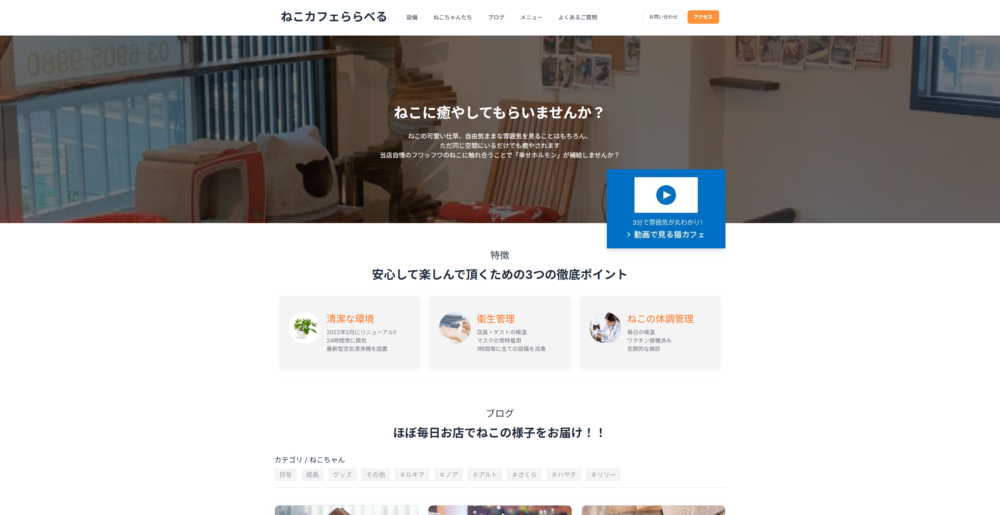
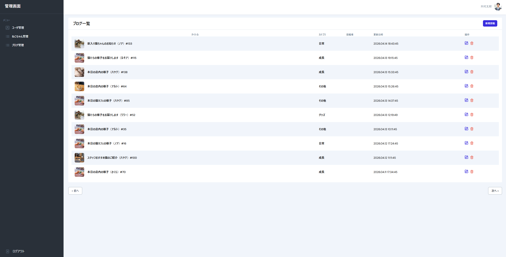

# 🐱 ねこカフェららべる（Laravelポートフォリオ）

## 📌 概要

本アプリは、ねこカフェのWebサイトを想定したLaravel製のポートフォリオです。
来店促進を目的としたフロントサイトと、ねこ・ブログ・ユーザ管理が可能な管理画面を実装しています。

教材ベースの機能に加え、独自要素としてUI改善・機能拡張・設計改善を行い、実務に近い構成へブラッシュアップしました。

---

## 🌐 デモ

※初回表示に数秒かかる場合がございます。もしページが表示されない場合は、お手数ですがページリロードをお願いいたします。

### フロントページ

https://hk-cat-cafe.onrender.com

#### 📸 スクリーンショット


### 管理画面

https://hk-cat-cafe.onrender.com/admin/login

#### 🔐 管理画面ログイン情報

```text
email: k_taro@example.com
password: taropass
```

#### 📸 スクリーンショット


---

## ✨ 主な機能

### 🏠 フロントページ

- トップページ
- 設備
- ねこちゃんたち
- ブログ一覧・投稿詳細
- メニュー一覧
- よくあるご質問（アコーディオンUI / Alpine.js）
- お問い合わせフォーム（Mail送信）

---

### 🔧 管理画面

- ログイン / ログアウト機能
- ユーザー作成
- ねこ管理（CRUD）
- ブログ管理（CRUD）

---

### 📩 メール機能

- お問い合わせ送信
- Mailpit連携（ローカルメール確認）

---

## 🛠 使用技術

| 種類         | 技術                     |
| ------------ | ------------------------ |
| フロント     | Tailwind CSS / Alpine.js |
| バックエンド | PHP 8 / Laravel          |
| DB           | MySQL                    |
| 開発環境     | Laravel Sail (Docker)    |
| メール       | Mailpit                  |

---

## 🧱 データベース設計（概要）

- users（ユーザ）
- blogs（ブログ）
- categories（カテゴリ）
- cats（ねこ）
- blog_cat（多対多）

※ blogs に user_id を追加し、投稿者とのリレーションを構築

---

## 🚀 セットアップ方法

```bash
# Git
git clone https://github.com/k-hondo/laravel-study.git
cd k-hondo/laravel-study.git

# 環境設定ファイル作成
cp .env.example .env

# 起動（※事前にDockerをインストールし、Docker起動が必要）
./vendor/bin/sail up -d
# 停止
./vendor/bin/sail down

# データベースの設定(マイグレーション)
./vendor/bin/sail artisan migrate

# ダミーデータ登録（シーディング）
./vendor/bin/sail artisan db:seed

```

---

## 💡 工夫した点

- Tailwind CSSを用いたUI改善（カードレイアウト）
- よくあるご質問ページにAlpine.jsでアコーディオン機能を実装
- 設備・メニュー・よくあるご質問などの独自ページを追加
- 画像を活用した**来店促進デザイン**
- Mailpitによる**メール開発環境構築**
- blogsとusersのリレーション追加による**実務的設計改善**
- select項目をEnumで管理し、保守性を考慮（例：app/Enums/Gender.php）
- デプロイ環境の構築（Render）

---

## 🚧 課題・今後の改善点

- 管理画面ダッシュボード追加
- 管理画面の権限制御（投稿者のみ編集）
- バリデーション強化
- UI/UXのさらなる改善（アニメーション・導線設計・レスポンシブ対応）
- お問い合わせ管理機能の追加（ステータス管理）
- ファイル管理機能の追加
- お知らせ管理機能の追加
- ねこ種類管理機能の追加
- 画像管理の統一（photosテーブル導入・S3対応）
- ブログ拡張（ブログ投稿者表示、投稿者が書いた記事を検索）
- テストコード追加（PHPUnit）

---

## 📂 ディレクトリ構成

```
app/
resources/
routes/
database/
docs/
```

---

## 📄 設計資料

詳細は以下を参照：

- [システム構成 (docs/architecture.md)](docs/architecture.md)
- [画面遷移図 (docs/screen-transition.md)](docs/screen-transition.md)
- [ER図 (docs/er-diagram.md)](docs/er-diagram.md)
- [DB設計書 (docs/database-design.md)](docs/database-design.md)

---

## 📚 参考

Udemy講座をベースに作成し、独自に機能追加・改良を行っています。

https://www.udemy.com/course/laravel9/

---

## 🙋‍♂️ 補足

本アプリは学習目的で作成したものですが、
実務を意識し以下の観点で改善を行っています。

- 保守性
- 拡張性
- UI/UX
- データ設計

---

## 🏁 最後に

Laravelの基礎から実務レベルへのステップとして制作しました。
今後も改善を続けていきます。
