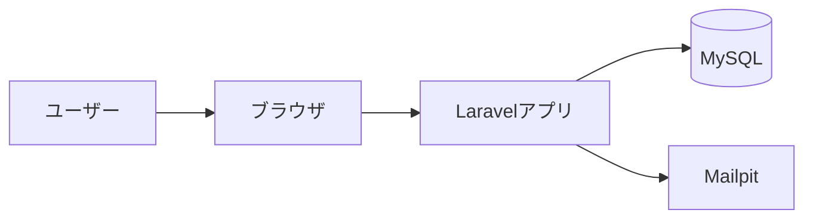

# システム構成

## 構成概要

---

## 使用技術

- Laravel（PHPフレームワーク）
- MySQL（データベース）
- Docker（Laravel Sail）
- Tailwind CSS（UI）
- Alpine.js（インタラクション）
- Mailpit（メール検証）

---

## 構成のポイント

- Docker環境により開発環境の再現性を確保
- Mailpitを利用してローカルで安全にメール検証
- フロントはBlade + Tailwindでシンプルに構築
