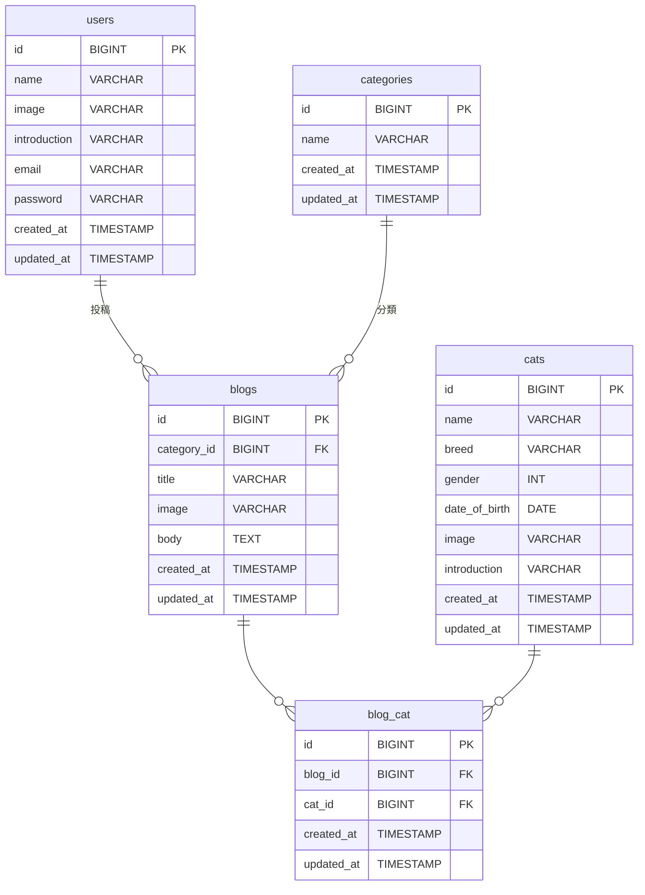

# ER図（詳細）

```mermaid
erDiagram

    users {
        id BIGINT PK
        name VARCHAR
        image VARCHAR
        introduction VARCHAR
        email VARCHAR
        password VARCHAR
        created_at TIMESTAMP
        updated_at TIMESTAMP
    }

    blogs {
        id BIGINT PK
        category_id BIGINT FK
        title VARCHAR
        image VARCHAR
        body TEXT
        created_at TIMESTAMP
        updated_at TIMESTAMP
    }

    categories {
        id BIGINT PK
        name VARCHAR
        created_at TIMESTAMP
        updated_at TIMESTAMP
    }

    cats {
        id BIGINT PK
        name VARCHAR
        breed VARCHAR
        gender INT
        date_of_birth DATE
        image VARCHAR
        introduction VARCHAR
        created_at TIMESTAMP
        updated_at TIMESTAMP
    }

    blog_cat {
        id BIGINT PK
        blog_id BIGINT FK
        cat_id BIGINT FK
        created_at TIMESTAMP
        updated_at TIMESTAMP
    }

    users ||--o{ blogs : "投稿"
    categories ||--o{ blogs : "分類"
    blogs ||--o{ blog_cat : ""
    cats ||--o{ blog_cat : ""
```
