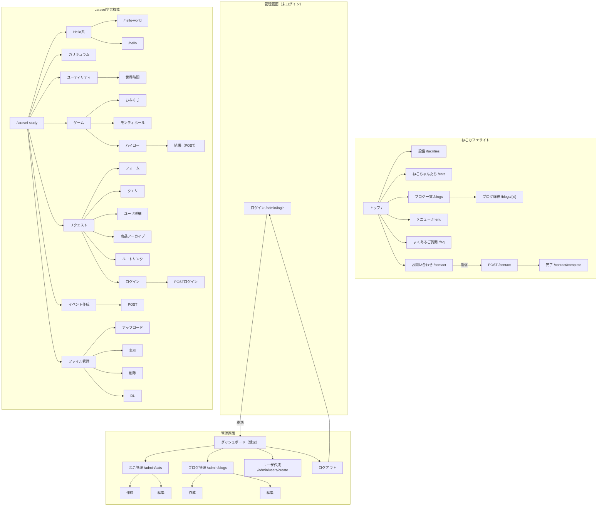

```mermaid
flowchart TD

%% =========================
%% フロント（ねこカフェ）
%% =========================
subgraph Front["ねこカフェサイト"]
    TOP["トップ /"] --> FAC["設備 /facilities"]
    TOP --> CAT["ねこちゃんたち /cats"]
    TOP --> BLOG["ブログ一覧 /blogs"]
    BLOG --> BLOG_DETAIL["ブログ詳細 /blogs/{id}"]
    TOP --> MENU["メニュー /menu"]
    TOP --> FAQ["よくあるご質問 /faq"]
    TOP --> CONTACT["お問い合わせ /contact"]

    CONTACT -->|送信| CONTACT_POST["POST /contact"]
    CONTACT_POST --> CONTACT_DONE["完了 /contact/complete"]
end

%% =========================
%% 管理画面（ログイン前）
%% =========================
subgraph Guest["管理画面（未ログイン）"]
    LOGIN["ログイン /admin/login"]
end

%% =========================
%% 管理画面（ログイン後）
%% =========================
subgraph Admin["管理画面"]
    DASH["ダッシュボード（想定）"]

    DASH --> ADMIN_CAT["ねこ管理 /admin/cats"]
    ADMIN_CAT --> CAT_CREATE["作成"]
    ADMIN_CAT --> CAT_EDIT["編集"]

    DASH --> ADMIN_BLOG["ブログ管理 /admin/blogs"]
    ADMIN_BLOG --> BLOG_CREATE["作成"]
    ADMIN_BLOG --> BLOG_EDIT["編集"]

    DASH --> USER_CREATE["ユーザ作成 /admin/users/create"]

    DASH --> LOGOUT["ログアウト"]
end

LOGIN -->|成功| DASH
LOGOUT --> LOGIN

%% =========================
%% Laravel学習
%% =========================
subgraph Study["Laravel学習機能"]
    STUDY_TOP["/laravel-study"]

    STUDY_TOP --> HELLO["Hello系"]
    HELLO --> HELLO1["/hello-world"]
    HELLO --> HELLO2["/hello"]

    STUDY_TOP --> CURRICULUM["カリキュラム"]

    STUDY_TOP --> UTILITY["ユーティリティ"]
    UTILITY --> WORLD_TIME["世界時間"]

    STUDY_TOP --> GAME["ゲーム"]
    GAME --> OMIKUJI["おみくじ"]
    GAME --> MONTY["モンティホール"]
    GAME --> HILOW["ハイロー"]
    HILOW --> HILOW_RESULT["結果（POST）"]

    STUDY_TOP --> REQUEST["リクエスト"]
    REQUEST --> FORM["フォーム"]
    REQUEST --> QUERY["クエリ"]
    REQUEST --> PROFILE["ユーザ詳細"]
    REQUEST --> PRODUCT["商品アーカイブ"]
    REQUEST --> ROUTE_LINK["ルートリンク"]
    REQUEST --> LOGIN_FORM["ログイン"]
    LOGIN_FORM --> LOGIN_EXEC["POSTログイン"]

    STUDY_TOP --> EVENT["イベント作成"]
    EVENT --> EVENT_STORE["POST"]

    STUDY_TOP --> FILE["ファイル管理"]
    FILE --> PHOTO_CREATE["アップロード"]
    FILE --> PHOTO_SHOW["表示"]
    FILE --> PHOTO_DELETE["削除"]
    FILE --> PHOTO_DOWNLOAD["DL"]
end
```
