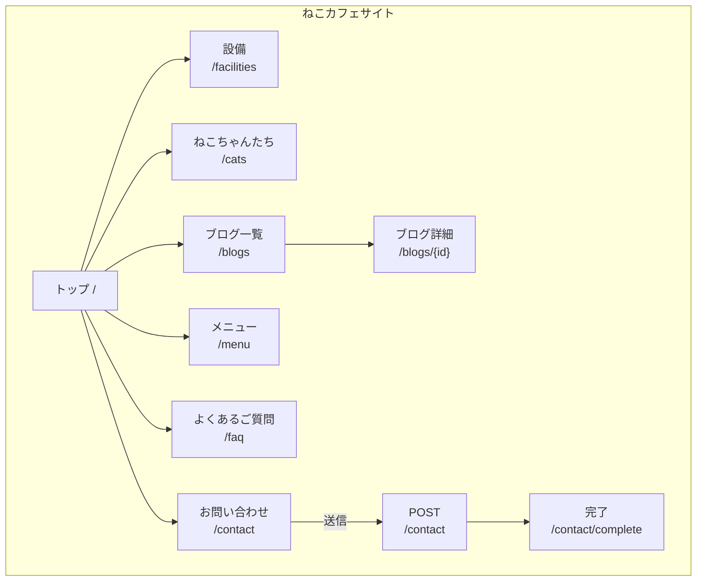
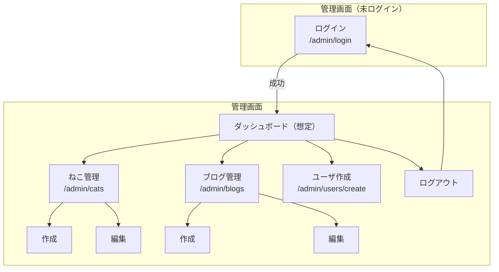
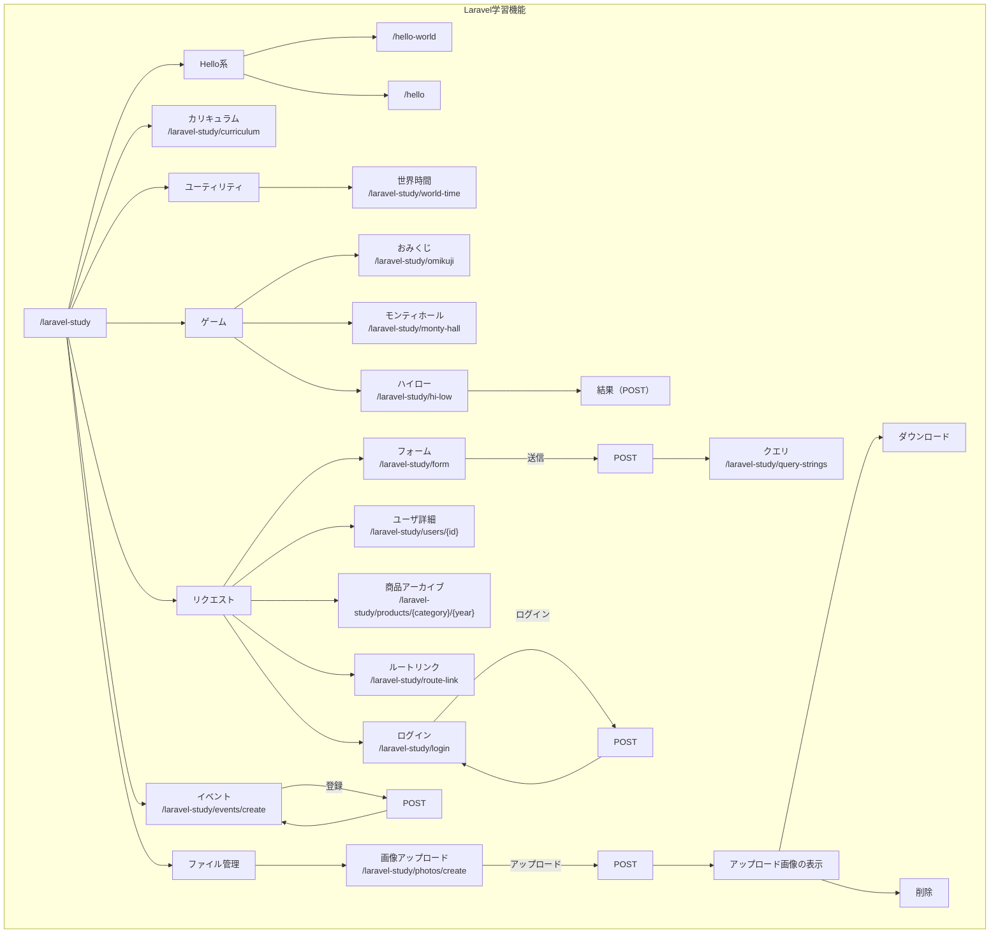

# 画面遷移図

## ねこカフェサイト フロントページ

```mermaid
flowchart TD

%% =========================
%% フロント（ねこカフェ）
%% =========================
subgraph Front["ねこカフェサイト"]
    TOP["トップ /"] --> FAC["設備<br>/facilities"]
    TOP --> CAT["ねこちゃんたち<br>/cats"]
    TOP --> BLOG["ブログ一覧<br>/blogs"]
    BLOG --> BLOG_DETAIL["ブログ詳細<br>/blogs/{id}"]
    TOP --> MENU["メニュー<br>/menu"]
    TOP --> FAQ["よくあるご質問<br>/faq"]
    TOP --> CONTACT["お問い合わせ<br>/contact"]

    CONTACT -->|送信| CONTACT_POST["POST<br>/contact"]
    CONTACT_POST --> CONTACT_DONE["完了<br>/contact/complete"]
end
```

## ねこカフェサイト 管理画面

```mermaid
flowchart TD

%% =========================
%% 管理画面（ログイン前）
%% =========================
subgraph Guest["管理画面（未ログイン）"]
    LOGIN["ログイン<br>/admin/login"]
end

%% =========================
%% 管理画面（ログイン後）
%% =========================
subgraph Admin["管理画面"]
    DASH["ダッシュボード（想定）"]

    DASH --> ADMIN_CAT["ねこ管理<br>/admin/cats"]
    ADMIN_CAT --> CAT_CREATE["作成"]
    ADMIN_CAT --> CAT_EDIT["編集"]

    DASH --> ADMIN_BLOG["ブログ管理<br>/admin/blogs"]
    ADMIN_BLOG --> BLOG_CREATE["作成"]
    ADMIN_BLOG --> BLOG_EDIT["編集"]

    DASH --> USER_CREATE["ユーザ作成<br>/admin/users/create"]

    DASH --> LOGOUT["ログアウト"]
end

LOGIN -->|成功| DASH
LOGOUT --> LOGIN
```

## Laravel学習

```mermaid
flowchart TD

%% =========================
%% Laravel学習
%% =========================
subgraph Study["Laravel学習機能"]
    STUDY_TOP["/laravel-study"]

    STUDY_TOP --> HELLO["Hello系"]
    HELLO --> HELLO1["/hello-world"]
    HELLO --> HELLO2["/hello"]

    STUDY_TOP --> CURRICULUM["カリキュラム<br>/laravel-study/curriculum"]

    STUDY_TOP --> UTILITY["ユーティリティ"]
    UTILITY --> WORLD_TIME["世界時間<br>/laravel-study/world-time"]

    STUDY_TOP --> GAME["ゲーム"]
    GAME --> OMIKUJI["おみくじ<br>/laravel-study/omikuji"]
    GAME --> MONTY["モンティホール<br>/laravel-study/monty-hall"]
    GAME --> HILOW["ハイロー<br>/laravel-study/hi-low"]
    HILOW --> HILOW_RESULT["結果（POST）"]

    STUDY_TOP --> REQUEST["リクエスト"]
    REQUEST --> FORM["フォーム<br>/laravel-study/form"]
    FORM -->|送信| FORM_POST["POST"]
    FORM_POST --> QUERY["クエリ<br>/laravel-study/query-strings"]
    REQUEST --> PROFILE["ユーザ詳細<br>/laravel-study/users/{id}"]
    REQUEST --> PRODUCT["商品アーカイブ<br>/laravel-study/products/{category}/{year}"]
    REQUEST --> ROUTE_LINK["ルートリンク<br>/laravel-study/route-link"]
    REQUEST --> LOGIN_FORM["ログイン<br>/laravel-study/login"]
    LOGIN_FORM -->|ログイン| LOGIN_EXEC["POST"]
    LOGIN_EXEC --> LOGIN_FORM

    STUDY_TOP --> EVENT["イベント<br>/laravel-study/events/create"]
    EVENT -->|登録| EVENT_STORE["POST"]
    EVENT_STORE --> EVENT

    STUDY_TOP --> FILE["ファイル管理"]
    FILE --> PHOTO_CREATE["画像アップロード<br>/laravel-study/photos/create"]
    PHOTO_CREATE -->|アップロード| PHOTO_POST["POST"]
    PHOTO_POST --> PHOTO_SHOW["アップロード画像の表示"]
    PHOTO_SHOW --> PHOTO_DOWNLOAD["ダウンロード"]
    PHOTO_SHOW --> PHOTO_DELETE["削除"]
end
```
